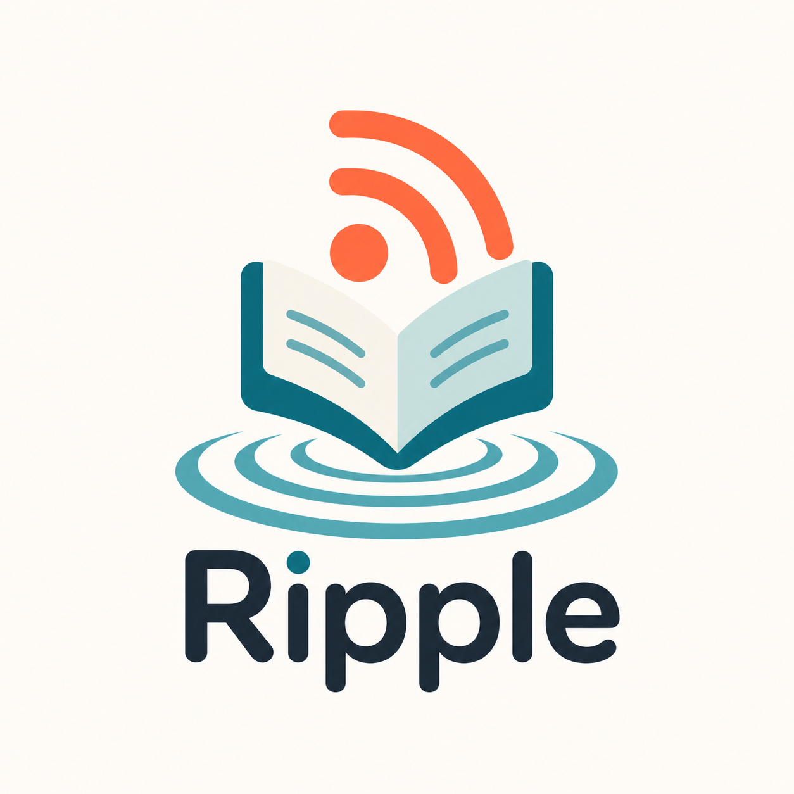
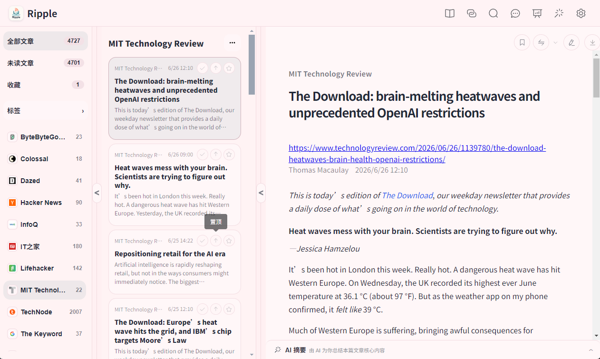
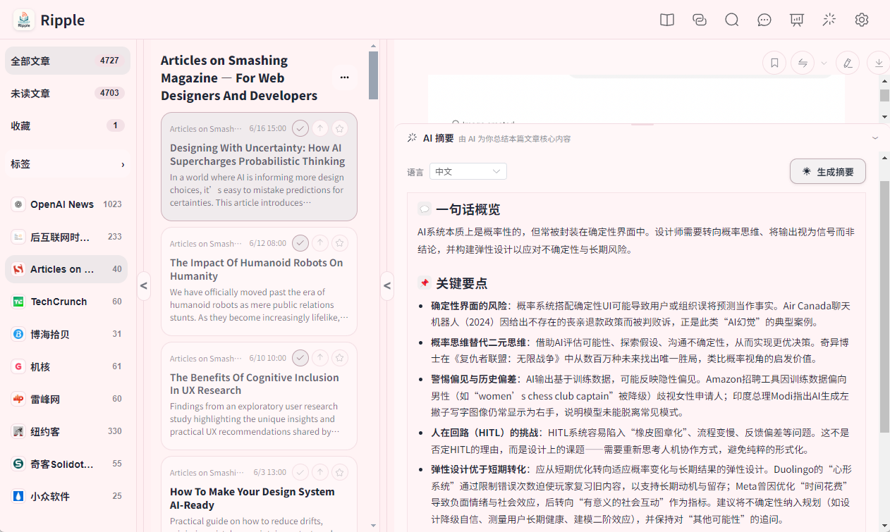
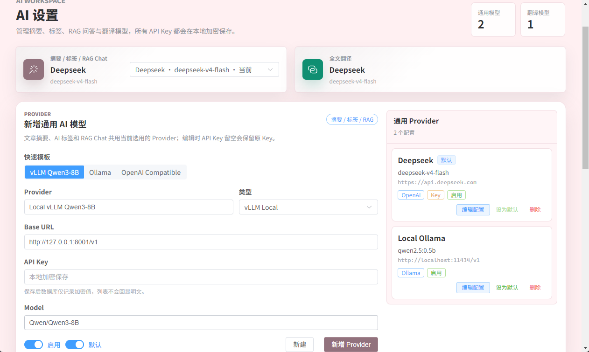
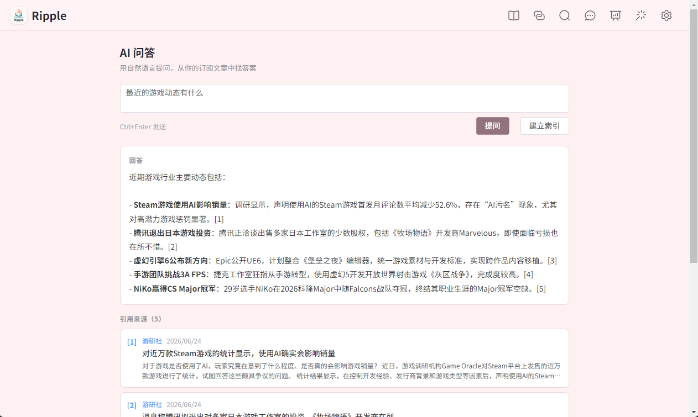
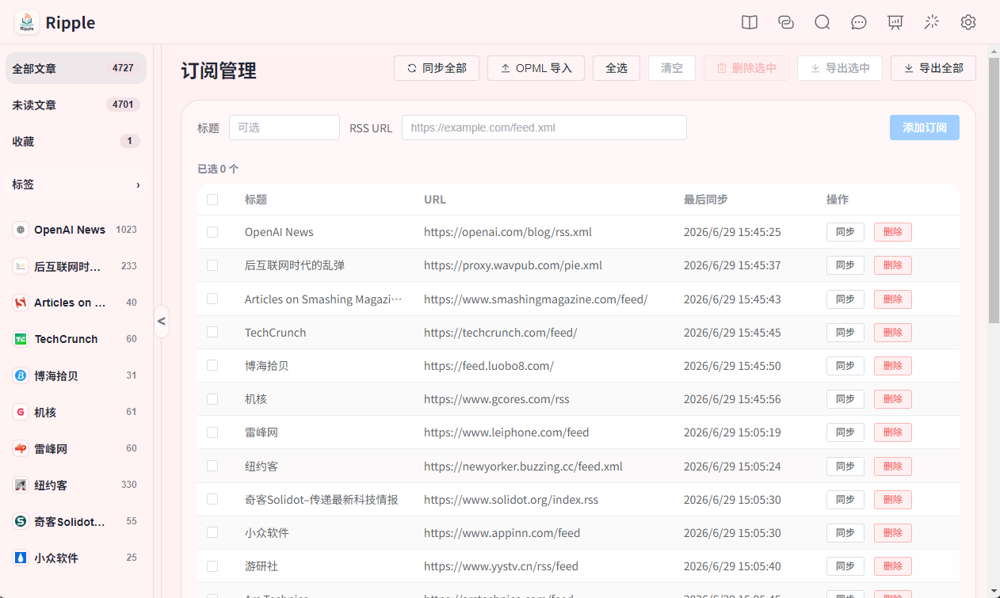
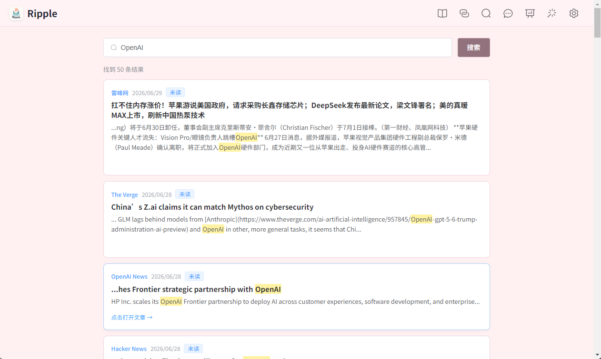

<div align="center">
  

  <h1>Ripple</h1>

  <p><strong>一款本地优先、支持 AI 摘要 / 翻译 / 问答的桌面 RSS 阅读器。</strong></p>

  <p>
    <a href="README.md">English</a>
    ·
    <a href="https://github.com/TheadoraTang/RSSReader/issues">问题反馈</a>
  </p>

  <p>
    
    
    
    
    
  </p>
</div>

---

## 快速概览

| 产品 | Ripple |
| --- | --- |
| 类型 | 桌面 RSS/Atom 阅读器 |
| 平台 | Windows, macOS |
| 数据模型 | 本地 SQLite 数据库 |
| AI Provider | OpenAI-compatible API, Ollama, vLLM, 自定义本地服务 |
| 主要流程 | 订阅、阅读、笔记、标签、搜索、导出、摘要、翻译、问答 |
| 问题反馈 | <https://github.com/TheadoraTang/RSSReader/issues> |

## 目录

- [产品概览](#产品概览)
- [产品截图](#产品截图)
- [核心功能](#核心功能)
- [技术架构](#技术架构)
- [安装说明](#安装说明)
- [本地开发与运行](#本地开发与运行)
- [打包与部署](#打包与部署)
- [AI 配置](#ai-配置)
- [数据与隐私](#数据与隐私)
- [常见问题](#常见问题)
- [问题反馈](#问题反馈)

## 产品概览

**Ripple** 是一款面向个人知识管理和资讯追踪的桌面 RSS/Atom 阅读器。它将订阅源管理、文章阅读、笔记、标签、搜索、导出、AI 摘要、AI 翻译和 RAG 问答整合在一个本地优先的阅读工作台中，帮助用户持续追踪信息、整理重点内容，并通过 AI 能力提升阅读与复盘效率。

Ripple 支持 Windows 与 macOS 桌面端。应用采用本地 SQLite 数据库存储订阅、文章、笔记、标签和 AI 调用记录；AI Provider 可使用 OpenAI-compatible API，也可接入 Ollama、vLLM 等本地模型服务。

<p align="center">
  
</p>

## 产品截图

| 阅读工作台 | AI 摘要 |
| --- | --- |
|  |  |

| AI 设置 | RAG 问答 |
| --- | --- |
|  |  |

| 订阅源管理 | 搜索 |
| --- | --- |
|  |  |

## 核心功能

| 功能模块 | 说明 |
| --- | --- |
| 订阅源管理 | 添加、编辑、删除 RSS/Atom Feed；支持批量删除订阅源。 |
| 文章同步 | 支持单个订阅源同步、全部订阅源同步、启动时同步与定时同步。 |
| OPML 导入导出 | 支持通过 OPML 文件迁移订阅列表，便于从其他阅读器迁入或备份。 |
| 阅读视图 | 展示订阅源、文章列表和文章详情；支持已读、未读、收藏状态管理。 |
| 内容清洗 | 对 RSS 内容进行 HTML 清洗和 Markdown 转换，提升正文可读性。 |
| 笔记 | 可为文章记录个人笔记，便于复盘和二次整理。 |
| 标签 | 支持文章标签管理，并保留 AI 辅助标签推荐流程中的人工确认。 |
| 搜索 | 支持面向文章内容的搜索入口，帮助快速定位历史阅读内容。 |
| 导出 | 支持单篇文章导出、批量 Markdown Digest 导出，以及桌面端保存对话框。 |
| AI 摘要 | 使用配置好的 LLM Provider 为文章生成摘要，并记录调用用量。 |
| AI 翻译 | 支持独立翻译 Provider、流式翻译、段落翻译、全文译文和原文/译文对照视图。 |
| RAG 问答 | 对订阅文章建立向量索引后，可用自然语言向本地文章库提问。 |
| 用量统计 | 展示 LLM 调用统计、异常记录和同步日志，便于排查配置问题。 |
| 阅读偏好 | 支持主题、配色、字号、行距、正文宽度等阅读体验设置。 |

## 技术架构

| 层级 | 技术 |
| --- | --- |
| 桌面端 | Electron |
| 前端 | Vue 3, Vite, Element Plus, Pinia, Vue Router |
| 后端 | FastAPI, Python |
| 数据库 | SQLite |
| 打包 | Electron Builder, PyInstaller |
| AI 接入 | OpenAI-compatible API, Ollama, vLLM, local embedding services |

## 安装说明

### Windows

1. 从 `release/` 目录或 GitHub Releases 下载最新的 `Ripple Setup x.x.x.exe`。
2. 双击安装包并按照安装向导完成安装。
3. 安装完成后，从桌面快捷方式或开始菜单启动 **Ripple**。
4. 首次启动后，进入 AI 设置页配置 LLM Provider；如果不使用 AI 功能，可直接开始添加订阅源。

### macOS

1. 从 GitHub Releases 下载最新的 `Ripple-x.x.x.dmg`。
2. 打开 `.dmg` 文件。
3. 将 **Ripple** 拖入 `Applications` 文件夹。
4. 从启动台或 `Applications` 中打开 Ripple。
5. 如果 macOS 提示应用来自未识别开发者，请在 `System Settings -> Privacy & Security` 中允许打开。

## 本地开发与运行

### 环境要求

| 工具 | 建议版本 |
| --- | --- |
| Node.js | 18+ |
| npm | 9+ |
| Python | 3.10+ |
| Git | 2.40+ |

### 安装依赖

```powershell
npm install
npm install --prefix frontend
python -m venv .venv1
.\.venv1\Scripts\Activate.ps1
pip install -r backend\requirements.txt
```

### 启动桌面开发环境

```powershell
npm run dev:desktop
```

该命令会自动启动：

| 服务 | 默认行为 |
| --- | --- |
| Vite 前端 | `http://127.0.0.1:5173` |
| FastAPI 后端 | 自动选择可用本地端口 |
| Electron 桌面端 | 自动加载前端并连接后端 |

## 打包与部署

### Windows 安装包

```powershell
npm run dist:desktop
```

构建完成后，安装包会输出到：

```text
release/Ripple Setup x.x.x.exe
```

Windows 包含：

| 内容 | 说明 |
| --- | --- |
| Electron Shell | 桌面应用运行时 |
| Vue 前端产物 | `frontend/dist` |
| PyInstaller 后端 | 自动打包 FastAPI 后端 |
| SQLite 数据目录 | 安装后在用户数据目录中自动创建 |

### macOS DMG

在 macOS 环境中执行：

```bash
npm install
npm install --prefix frontend
python3 -m venv .venv1
source .venv1/bin/activate
pip install -r backend/requirements.txt
npm run dist:desktop
```

构建完成后，DMG 文件会输出到：

```text
release/Ripple-x.x.x.dmg
```

macOS 打包注意事项：

| 项目 | 说明 |
| --- | --- |
| 打包平台 | 建议在 macOS 本机打包 DMG。 |
| Python 后端 | 通过 PyInstaller 打包为随应用分发的本地后端。 |
| 签名与公证 | 如果面向公开分发，建议配置 Apple Developer ID 签名和 notarization。 |
| 首次打开提示 | 未签名版本可能需要用户在系统隐私设置中手动允许打开。 |

## AI 配置

在应用内打开 **AI 设置** 页面后，可以配置以下 Provider：

| 配置项 | 用途 |
| --- | --- |
| 通用 AI Provider | 用于文章摘要、AI 标签推荐和 RAG Chat。 |
| 翻译 Provider | 用于全文翻译、段落翻译和对照阅读。 |
| Embedding 配置 | 用于 RAG 问答的向量索引。 |

支持的 Provider 类型：

| 类型 | 示例 |
| --- | --- |
| OpenAI-compatible | OpenAI, DeepSeek-compatible services, TokenHub-compatible services |
| vLLM Local | `http://127.0.0.1:8001/v1` |
| Ollama | `http://127.0.0.1:11434/v1` |
| Custom | 自定义兼容接口 |

API Key 会加密保存在本地。编辑 Provider 时，如果 API Key 输入框留空，系统会保留原有 Key。

## 数据与隐私

| 数据类型 | 存储位置 |
| --- | --- |
| 订阅源、文章、笔记、标签 | 本地 SQLite 数据库 |
| AI Provider 配置 | 本地数据库，加密保存 Key |
| AI 调用日志与用量 | 本地数据库 |
| 导出文件 | 用户选择的本地路径 |

Ripple 默认采用本地优先设计。除非用户主动配置并调用第三方 AI Provider，否则阅读数据不会被发送到外部 AI 服务。

## 常见问题

| 问题 | 处理方式 |
| --- | --- |
| 无法同步订阅源 | 检查 Feed URL 是否可访问，并查看同步日志。 |
| AI 摘要或翻译失败 | 检查 Provider 的 Base URL、Model、API Key 和网络代理配置。 |
| RAG 问答无结果 | 先在 AI 问答页执行“建立索引”，再进行提问。 |
| Windows 桌面图标未刷新 | 卸载旧版本并重新安装；必要时删除旧桌面快捷方式。 |
| macOS 无法打开应用 | 在系统隐私与安全设置中允许打开，或使用已签名版本。 |

## 问题反馈

如果遇到 Bug、安装失败、AI Provider 配置异常或功能建议，请提交到 GitHub Issues：

<https://github.com/TheadoraTang/RSSReader/issues>

反馈时建议附上：

| 信息 | 示例 |
| --- | --- |
| 操作系统 | Windows 11 / macOS 14 |
| Ripple 版本 | 例如 `0.1.5` |
| 问题现象 | 页面报错、无法同步、AI 调用失败等 |
| 复现步骤 | 1. 打开页面；2. 点击按钮；3. 出现错误 |
| 日志或截图 | 同步日志、控制台错误、错误截图 |
